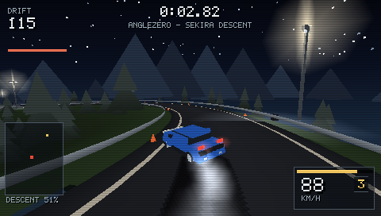

# Angle Zero

A night-time downhill drift game for the Sony PSP, written in Rust.

Sekira Pass after dark. Sideways the whole way down.

<br>

<p align="center">
  
</p>

<br>

## Install

Download `AngleZero.0.1.0.zip` from [Releases](https://github.com/ItsNoHax/AngleZero/releases) and
unzip it at the root of the memory stick. That is the whole installation — the archive holds one
file, already in the right place:

```
PSP/GAME/AngleZero/EBOOT.PBP
```

Then it appears under Game → Memory Stick.

It needs custom firmware. Stock firmware will not launch unsigned homebrew, and there is nothing
this end can do about that.

## Building from source

```bash
cargo psp --release
```

Copy `target/mipsel-sony-psp/release/angle-zero.EBOOT.PBP` to `PSP/GAME/AngleZero/EBOOT.PBP` on a
memory stick, renaming it to exactly `EBOOT.PBP`.

To run the whole test suite, which needs no PSP and no emulator:

```bash
cargo test
```

To build the same archive the releases are cut from:

```bash
scripts/release.sh
```

Toolchain, emulator setup and controls are in [Building and running](docs/building.md).

## Documentation

| | |
|---|---|
| [The idea](docs/design.md) | What the game is and why it works the way it does |
| [Building and running](docs/building.md) | Toolchain, build flags, controls, running under PPSSPP |
| [Architecture](docs/architecture.md) | The crate split, and how the game is tested on the host |
| [PSP hardware notes](docs/psp-notes.md) | Traps the hardware sets that emulators do not, and where the frame budget goes |
| [Diagnostics](docs/diagnostics.md) | Capturing frames and traces from the console, and headless screenshots |
| [Assets](docs/assets.md) | The XMB icon, background and music, and how the ATRAC3 is encoded |
| [Cars](docs/cars.md) | Turning a 400k-triangle model into a car the console draws, and adding another |

## Layout

```
src/            game core — no PSP dependency, runs and is tested on the host
src/psp/        the shell: GU setup, rendering, audio, save data, diagnostics
tools/          the car asset compiler — host-only, never built for the console
tests/          288 tests, all host-side
scripts/        music encoding, the glitch hunt, pulling captures off a PSP
assets/         XMB icon, background, music, and the car models in three stages
docs/           everything above
```

The split is the point: `src/` knows nothing about the PSP, so track generation, physics, scoring,
the camera and the screen flow are all ordinary Rust that `cargo test` exercises directly. Only
`src/psp/` needs hardware, and it holds no game logic. See
[Architecture](docs/architecture.md).

The same split runs the other way for content. `tools/anglezero-asset` compiles a car model into a
`.azcar` on a development machine; the console opens that file and draws it. Adding a car is a
model, a config file and a conversion — no renderer code. See [Cars](docs/cars.md).

## Credits

The car models are other people's work, under licences that require attribution — four of the seven
are non-commercial. Each car's credit is read out of its compiled asset and drawn on the title
screen, so the attribution ships with the car rather than with this file. The models, their authors
and what each licence allows are in [Cars](docs/cars.md#licences).
