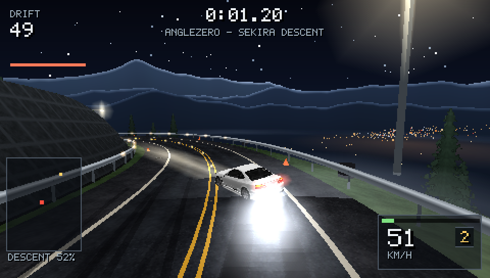
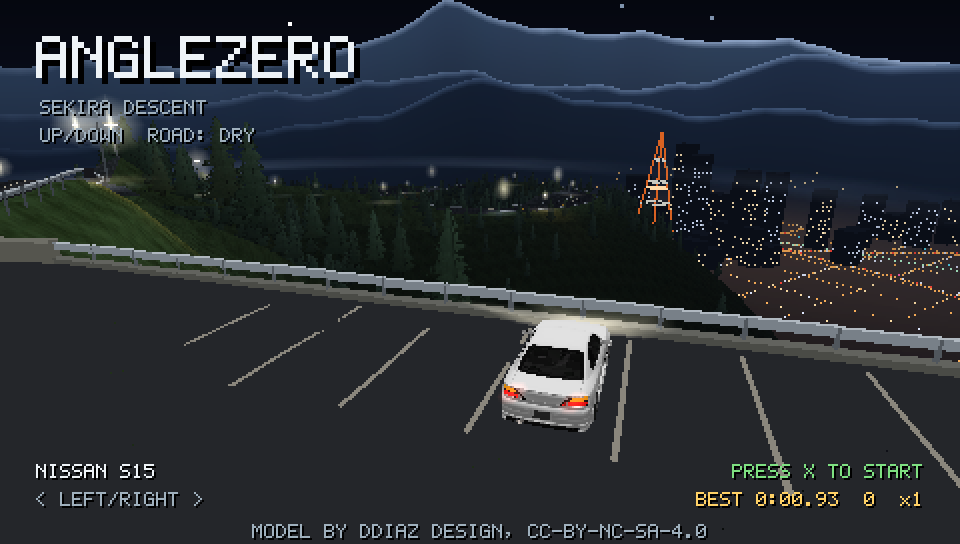

# Angle Zero

A night-time downhill drift game for the Sony PSP, written in Rust.

<p align="center">
  
</p>
<p align="center">
  
</p>

## Install

Runs on any PSP, on official or custom firmware.

1. Download the latest `AngleZero.<version>.zip` from [Releases](https://github.com/ItsNoHax/AngleZero/releases).
2. Unzip it at the root of the memory stick.
3. Launch from **Game → Memory Stick**.

Cars are separate `.azcar` files in `PSP/GAME/AngleZero/CARS/`. Add or remove them freely; the
title screen lists whatever is there.

## Build

```bash
cargo psp --release   # target/mipsel-sony-psp/release/angle-zero.EBOOT.PBP
cargo test            # host-side test suite, no PSP or emulator needed
scripts/release.sh    # dist/AngleZero.<version>.zip, EBOOT encrypted for official firmware
```

The EBOOT that `cargo psp` writes is unencrypted, so it runs only on custom firmware or in PPSSPP.
`scripts/release.sh` encrypts it with [`pspbuild`](https://github.com/ItsNoHax/pspbuild), a
workspace dependency that cargo fetches itself, so it also boots on official firmware.

See [Building and running](docs/building.md) for toolchain setup and controls.

## Documentation

| Document | Contents |
|---|---|
| [Design](docs/design.md) | What the game is and the constraints behind it |
| [Building and running](docs/building.md) | Toolchain, build flags, emulator, controls, releases |
| [Architecture](docs/architecture.md) | Crate layout and host-side testing |
| [PSP hardware notes](docs/psp-notes.md) | Hardware and SDK pitfalls, performance |
| [Diagnostics](docs/diagnostics.md) | On-device captures, headless screenshots, glitch hunting |
| [Assets](docs/assets.md) | XMB icon, background and music |
| [Cars](docs/cars.md) | The car asset pipeline, adding a car, licences |

## Credits

Car models are third-party work under Creative Commons licences; most are non-commercial. Each
car's credit is embedded in its `.azcar` and shown on the title screen. Sources and licences are
listed in [Cars → Licences](docs/cars.md#licences).
